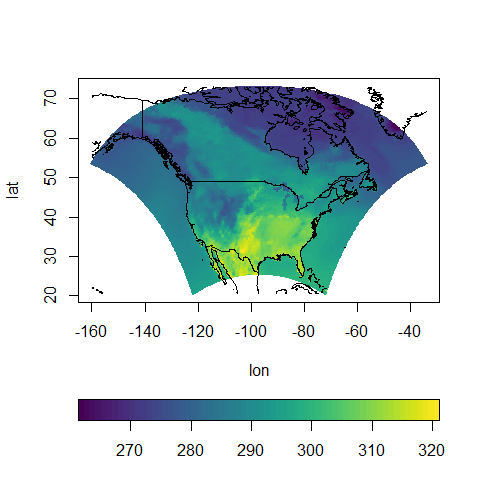
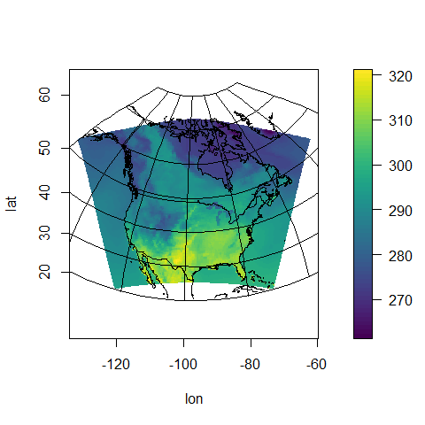
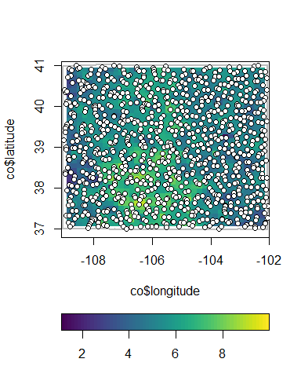
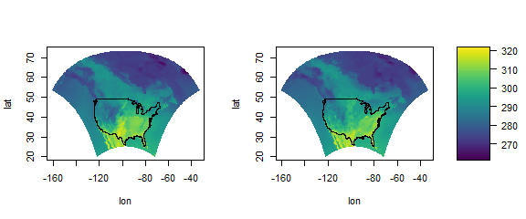

autoimage README
================

[](https://travis-ci.org/jpfrench81/autoimage)[](https://codecov.io/gh/jpfrench81/autoimage)

The **autoimage** R package
===========================

``` r
knitr::opts_chunk$set(
  fig.path = "tools/README/"
)
```

Introduction
------------

The goal of the **autoimage** package is to easily plot a sequence of images with corresponding color scales, i.e., a sequence of heatmaps, with straightforward, native options for projection of geographical coordinates. The package makes it simple to add lines, points, and other graphics features to these image plots, even when the coordinates are projected. The package allows for seamless creation of heat maps for data on regular or irregular grids, as well as that is not on a grid.

Installation
------------

The release version of **autoimage** can be installed in R using the command `install.packages("autoimage")`.

The development version of `autoimage` can be installed in R using the command:

    # install.packages("devtools")
    devtools::install_github("jpfrench81/autoimage")

Examples
--------

The most important functions in **autoimage** are the `pimage` and `autoimage` functions. `pimage` creates a heat map with a color scale for data on a regular or irregular grid, and even non-gridded data (by automatically interpolating onto a grid). The `autoimage` function generalizes the `pimage` function to allow for multiple images in the same plot.

The **autoimage** package makes it easy to add lines and points to the images plots, with several common world maps being provided automatically through the **maps** package.

We illustrate some basic usage of the `pimage` function.

We begin by creating image plots for data on an irregular grid while also including national boundaries and a legend. The coordinates are projected in the second plot by specifying the desired projection via the `proj` argument and the relevant projection parameters via the `parameters` arguments.

``` r
# display some narccap data on an irregular grid
data(narccap)
# heat map for data on an irregular grid with national boundaries
pimage(lon, lat, tasmax[,,1], map = "world", legend = "h")
```



``` r
# same plot but with projection
pimage(lon, lat, tasmax[,,1], map = "world", legend = "v",
       proj = "bonne", parameters = 45)
```



We next display an image for data that is not on a grid. Specifically, we create image plots for Colorado geochemical measurements. We also include the Colorado border in the image and the locations of the observed coordinates. Note that the `lines.args` and `points.args` arguments are used to customize the appearance of the lines and points.

``` r
# colorado data not on a grid
# show observed locations on image,
# along with Colorado border
data(co, package = "gear") # load colorado geochemical measurements
data(copoly) # load colorado borders
# create list with observed points
copoints <- list(x = co$lon, y = co$lat) 
pimage(co$longitude, co$latitude, co$Al, 
       lines = copoly, 
       lines.args = list(lwd = 2, col = "grey"),
       points = copoints, 
       points.args = list(pch = 21, bg = "white"),
       xlim = c(-109.1, -102),
       ylim = c(36.8, 41.1))
```



The `autoimage` function generalizes the `pimage` function to allow for a sequence of images in a single graphic. We display two images, first with a common legend, then with individual legends for each image.

``` r
# plot images with USA state borders and common vertical scale
autoimage(lon, lat, tasmax[,,1:2], legend = "v", map = "usa")
```



``` r
# with separate scales
autoimage(lon, lat, tasmax[,,1:2], common.legend = FALSE, map = "usa")
```


